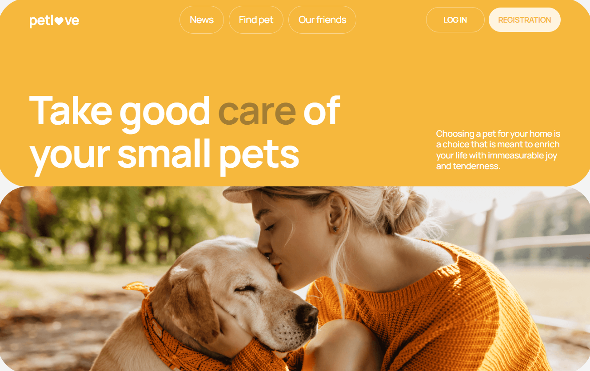

# Petlove pet-project

Petlove is a vibrant online platform designed to bring together pet enthusiasts and support animal welfare. Whether you're looking to find a lost pet or bring a new furry friend into your life, Petlove is here to help.

## Key features

1. Registration and login. Users can register on the platform or login using their email addresses.
2. Latest animal news. Stay updated with the latest news and information from the world of animals.
3. Supported projects. Learn about animal-related projects that support the current platform.
4. Pet search. Find pets of interest using filters for categories, gender, price and location.
5. Sorting options. Sort search results by price or popularity to easily find what you're looking for.
6. For logged-in users:
   - Additional Pet Information. Access detailed information about pets, including contact details and location.
   - Favorites list. Add pets to your favorites list for easy reference.
   - Personal and pet information. Manage your personal information and details about your own pets.

## Technologies and Tools Used

### Languages:

- JavaScript
- HTML5
- CSS3

### Libraries and Frameworks:

- React
- Redux Toolkit
- Tailwind CSS
- React Hook Form
- Yup
- React Notifications Component
- React Select
- React Calendar

### Deployment:

- Github Pages

### Development utilities:

- Vite
- VS Code
- Git

## Links

[Model figma](https://www.figma.com/file/puMNfZVg4YI8UZoJ1QiLLi/Petl%F0%9F%92%9Bve?type=design&node-id=55838-750&mode=design&t=Xg1IwIcKebTl5xGs-0)

[Technical specification](https://docs.google.com/spreadsheets/d/1DmQUeGZy_oaXN6yn69ORLzou1ZQRyTMlrAqPSit_clw/edit?gid=1134921873#gid=1134921873)

[Backend API Documentation](https://petlove.b.goit.study/api-docs/)

## Contributor

Alina Tantsura - Developer

- [GitHub](https://github.com/AlinaTantsura)
- [LinkedIn](https://www.linkedin.com/in/alina-tantsura/)
